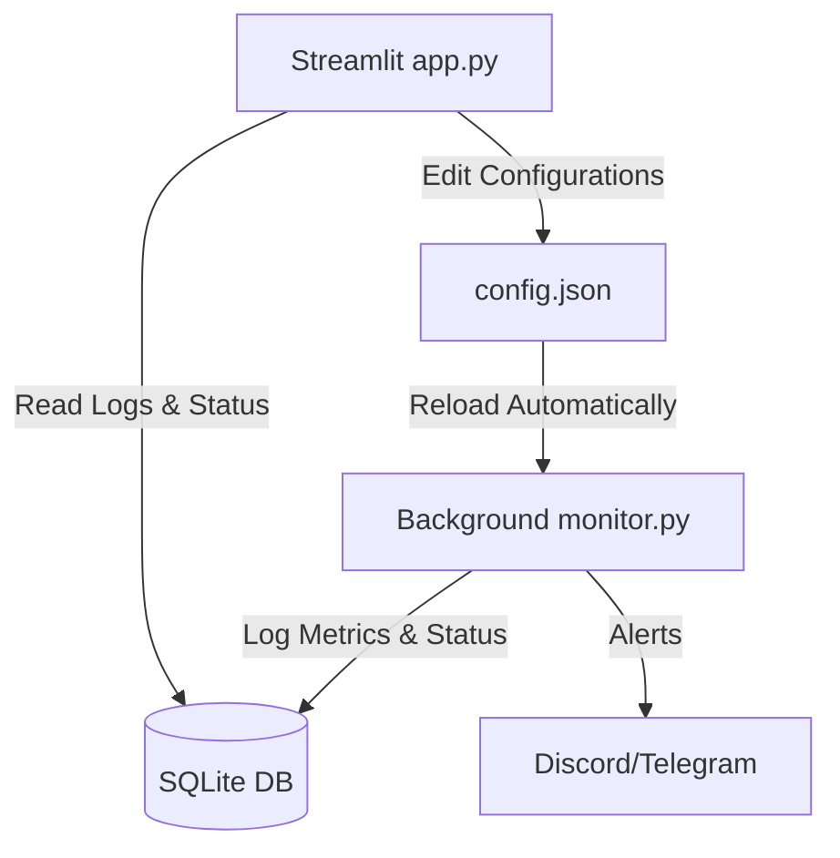

# 📡 Advanced Automated Network & System Monitor

[](https://github.com/TamNguyenmeomeo/11_network_system_monitor/actions/workflows/ci.yml)
[](https://opensource.org/licenses/MIT)
[](https://streamlit.io)

An advanced, offline-first Network and System resource monitoring application built with **Streamlit**, **SQLite**, and **psutil**. It logs historical CPU, RAM, and Disk metrics along with host connection (ping) logs to a local database, and dispatches automated alerts to Discord or Telegram when thresholds are breached or hosts go offline.

---

## 🎨 User Interface Preview

### Dark Mode (Giao diện Tối)
The dark theme uses a modern gradient background with glassmorphism cards and bright badges:


### Light Mode (Giao diện Sáng)
The light theme uses a clean, high-contrast slate gradient for optimal daylight monitoring:


---

## 🌟 Key Features

*   **System Metric Logging:** Automatically logs CPU, RAM, and Disk usage using Python's `psutil` library.
*   **Target Host Pinger:** Periodically pings list of target IPs/domains and logs their ONLINE/OFFLINE status.
*   **Interactive Web Dashboard:** Modern Web UI displaying real-time gauges, historical line charts, and device grids.
*   **Web Form Configuration Editor:** Add/remove targets and change alert thresholds directly from the browser.
*   **Multi-Channel Alerts:** Dispatches instant warnings to Discord via Webhooks or Telegram channel bots.
*   **Simulation Mode:** Built-in simulation tool to trigger spike warnings and test Webhook notification relays.

---

## 📘 Detailed End-User Guide & Explanation

To make it easy for non-technical users to understand and operate the system, here is a detailed breakdown of the dashboard metrics and controls:

### 1. Understanding System Resources
*   **CPU Usage:** Think of this as the **"brain"** of the computer. It handles all running calculations and tasks.
    *   *Normal Level:* Typically fluctuates between **5% and 60%** depending on what programs are open.
    *   *When to Worry:* If it consistently stays above **90%** (digits will turn red), the computer may slow down, freeze, or overheat (fans spinning fast).
*   **RAM Usage:** Think of this as the **"desk space"** in an office. RAM stores temporary data of active applications for quick retrieval by the CPU.
    *   *Normal Level:* Typically stays between **30% and 80%**.
    *   *When to Worry:* If it exceeds **90%**, the computer runs out of memory, causing software to crash or freeze.
*   **Disk Usage:** Think of this as the **"filing cabinet"** for long-term storage (operating system files, personal documents, and apps).
    *   *Normal Level:* Depends on how much data you have saved.
    *   *When to Worry:* If it reaches **95%** or more, you will not be able to save new files, download updates, or start the system correctly.

### 2. How the Target Host Pinger Works
*   **"Ping"** is a command that sends a quick *"Are you there?"* message to a computer or website over the network.
    *   🟢 **ONLINE:** The target responded successfully. The network connection is stable.
    *   🔴 **OFFLINE:** The target did not respond. This could mean the device is powered off, disconnected from the network, or configured incorrectly. The system will dispatch an alert instantly.

### 3. How to Use the Sidebar Controls
The sidebar forms are cleanly tucked inside expanders to keep the view neat:
*   **Alert Thresholds & Webhooks:**
    *   Set the danger threshold percentage for CPU, RAM, and Disk.
    *   Paste your **Discord Webhook URL** or **Telegram Bot Token/Chat ID** to receive automatic alert notifications directly to your phone/PC.
*   **Add Target Host:**
    *   If you have a network printer, IP camera, or local server, type its **friendly name** (e.g., `Office Printer`) and **IP Address** (e.g., `192.168.1.50`). The system will scan it every 10 seconds.
*   **Remove Target Host:**
    *   Select any host from the dropdown list and click the button to stop monitoring it.
*   **Alert System Simulation:**
    *   Click the simulation button to trigger a safe, artificial alert (e.g., spiking CPU or offline target) to verify that your Discord or Telegram alerts are coming through correctly without affecting real hardware.

---

## 🏗️ System Architecture



---

## 💻 Local Setup & Execution Guide

### Step 1: Install Dependencies
Open your terminal in this directory and install requirements:
```bash
pip install -r requirements.txt
```

### Step 2: Initialize background logger
Start the background pinger and performance collector:
```bash
python monitor.py
```
*(This script will create `config.json` and initialize the local database `monitor_logs.db` automatically)*.

### Step 3: Run the Web Dashboard
Launch the interactive web page:
```bash
streamlit run app.py
```
Open your browser at `http://localhost:8501` to view your system metrics!

---

## 🧪 Running Unit Tests
To verify database structure, logging, and ping functionalities, run:
```bash
python -m unittest tests/test_monitor.py
```

---

## 📄 License
This project is licensed under the MIT License - see the [LICENSE](LICENSE) file for details.
