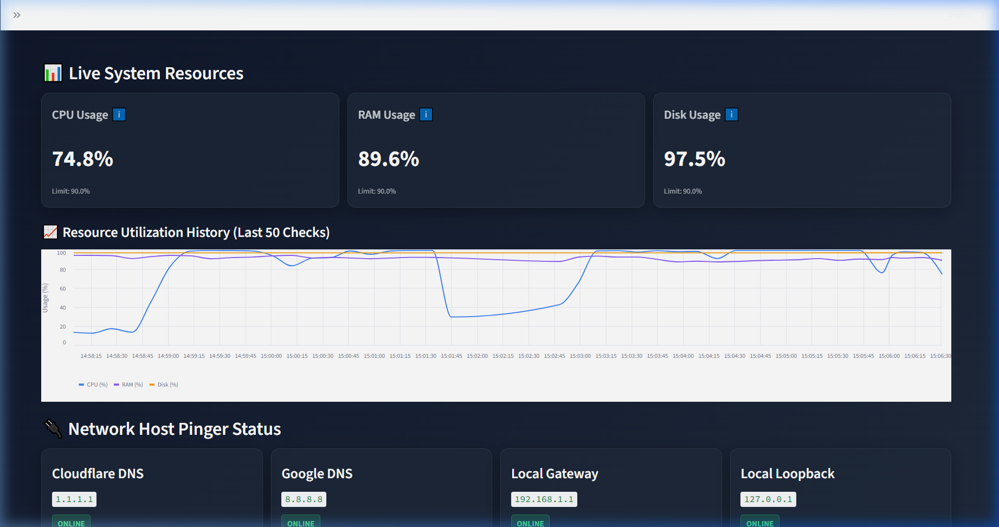
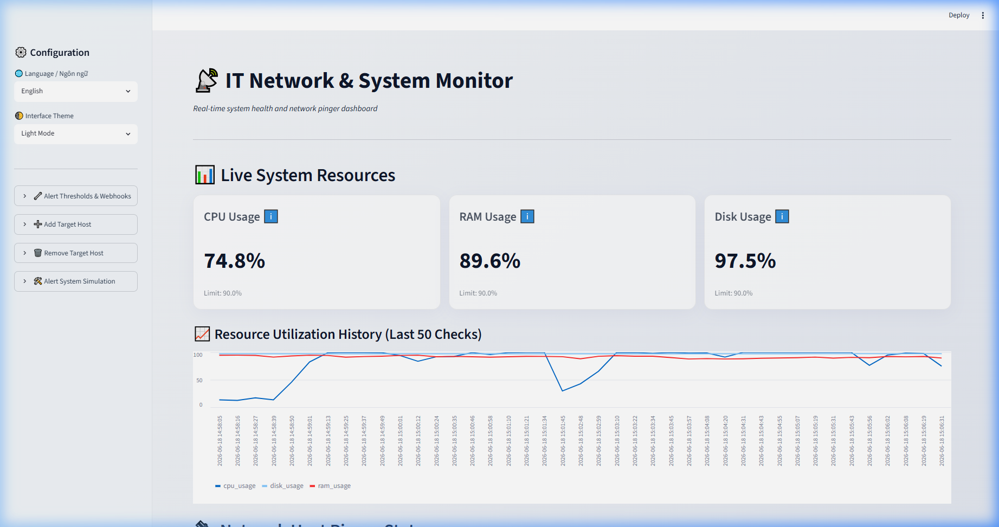
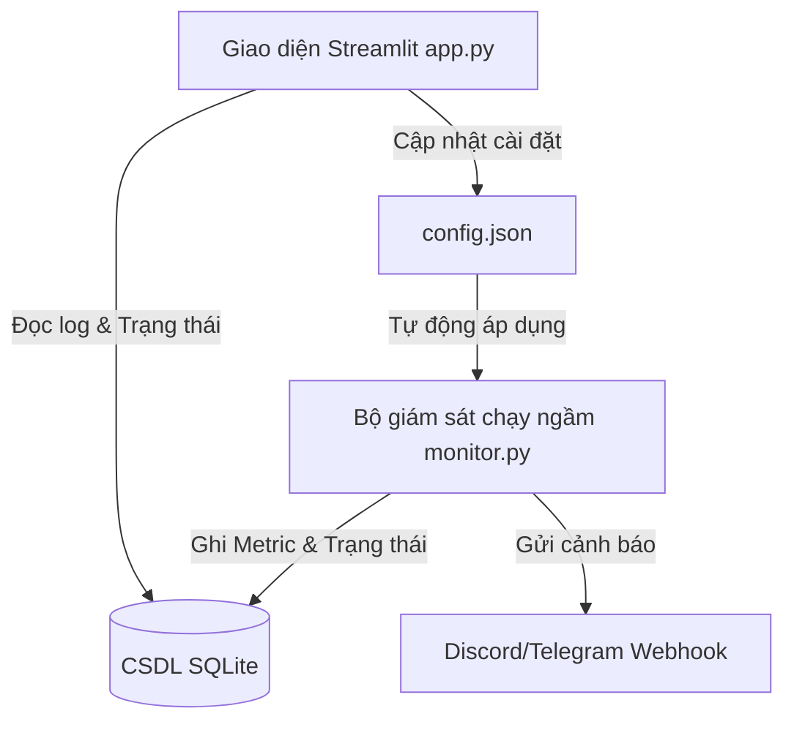

# 📡 Bộ giám sát Kết nối Mạng & Hiệu năng Hệ thống Tự động (Network & System Monitor)

[](https://github.com/TamNguyenmeomeo/11_network_system_monitor/actions/workflows/ci.yml)
[](https://opensource.org/licenses/MIT)
[](https://streamlit.io)

Ứng dụng web giám sát tài nguyên máy tính và kiểm tra kết nối mạng (offline-first) hiện đại được xây dựng bằng **Streamlit**, **SQLite** và **psutil**. Hệ thống ghi lại lịch sử hiệu năng CPU, RAM, ổ cứng cùng nhật ký kết nối (ping) của các máy chủ chỉ định vào cơ sở dữ liệu cục bộ, đồng thời gửi cảnh báo tức thời tới Discord/Telegram khi có sự cố quá tải hoặc mất mạng xảy ra.

---

## 🎨 Giao diện xem trước của ứng dụng

### Giao diện Tối (Dark Mode)
Giao diện tối được thiết kế với nền gradient hiện đại cùng các thẻ kính mờ (glassmorphism) và nhãn cảnh báo trạng thái trực quan:


### Giao diện Sáng (Light Mode)
Giao diện sáng sử dụng độ tương phản cao, nền dịu mắt giúp việc kiểm tra và theo dõi hệ thống ban ngày dễ dàng hơn:


---

## 🌟 Tính năng chính

*   **Đo lường hiệu năng tự động:** Quét liên tục và ghi lại tỉ lệ CPU, RAM, ổ cứng bằng thư viện Python `psutil`.
*   **Kiểm tra trạng thái máy chủ (Ping):** Liên tục gửi gói tin ICMP (ping) tới danh sách IP/Domain chỉ định để giám sát tình trạng Online/Offline.
*   **Web Dashboard tương tác:** Giao diện điều khiển Streamlit hiển thị biểu đồ tài nguyên trực quan và lưới hiển thị trạng thái máy chủ dạng thẻ.
*   **Cấu hình trực tiếp trên Web UI:** Thêm/xóa địa chỉ máy chủ cần ping và thay đổi ngưỡng cảnh báo tài nguyên trực tiếp từ trình duyệt.
*   **Cảnh báo đa kênh:** Gửi tin nhắn cảnh báo tự động về Discord Webhook hoặc Telegram Bot của bạn.
*   **Giả lập sự cố:** Chế độ `--simulate` tích hợp giúp giả lập máy chủ ngoại tuyến hoặc quá tải CPU/RAM để kiểm tra hoạt động của thông báo cảnh báo.

---

## 📘 Giải nghĩa Chỉ số & Hướng dẫn Sử dụng (Cho Người dùng cuối)

Để giúp những người dùng không chuyên về kỹ thuật cũng có thể dễ dàng hiểu và vận hành hệ thống, dưới đây là bảng giải nghĩa chi tiết các thông số hiển thị và cách sử dụng các tính năng trên giao diện:

### 1. Giải nghĩa Tài nguyên Hệ thống (Live System Resources)
*   **Tỉ lệ CPU (Bộ vi xử lý):** Được ví như **"bộ não"** của máy tính. CPU xử lý mọi tính toán và câu lệnh.
    *   *Mức bình thường:* Thường dao động từ **5% đến 60%** tùy thuộc vào các phần mềm đang mở.
    *   *Khi nào đáng lo ngại?* Nếu chỉ số này liên tục vượt quá **90%** (chữ số sẽ chuyển màu đỏ cảnh báo), máy tính của bạn có thể sẽ bị chậm, giật lag, hoặc quạt tản nhiệt kêu to do bị quá nhiệt.
*   **Dung lượng RAM (Bộ nhớ tạm thời):** Được ví như **"mặt bàn làm việc"**. RAM lưu trữ tạm thời dữ liệu của các ứng dụng đang chạy để CPU truy xuất nhanh.
    *   *Mức bình thường:* Thường ở mức **30% đến 80%**.
    *   *Khi nào đáng lo ngại?* Nếu RAM vượt quá **90%**, hệ thống không còn đủ không gian hoạt động, dẫn đến việc các phần mềm tự động bị tắt đột ngột (crash) hoặc đứng máy.
*   **Ổ cứng (Disk Usage):** Được ví như **"tủ tài liệu"** lưu trữ lâu dài (hệ điều hành, tệp tin cá nhân, ứng dụng).
    *   *Mức bình thường:* Phụ thuộc vào lượng dữ liệu bạn lưu.
    *   *Khi nào đáng lo ngại?* Nếu ổ cứng bị đầy (vượt quá **95%**), bạn sẽ không thể lưu thêm tệp mới, không thể cập nhật phần mềm, và hệ điều hành có thể gặp lỗi khởi động nghiêm trọng.

### 2. Cách hoạt động của Bộ kiểm tra máy chủ (Ping Status)
*   **"Ping"** là một lệnh kiểm tra nhanh bằng cách gửi một tin nhắn ngắn dạng *"Bạn có đó không?"* tới một máy tính khác hoặc một trang web qua mạng internet.
    *   🟢 **ONLINE (Hoạt động):** Máy chủ phản hồi tin nhắn thành công. Kết nối mạng ổn định.
    *   🔴 **OFFLINE (Mất kết nối):** Không nhận được phản hồi. Có thể do máy chủ bị tắt nguồn, bị đứt cáp mạng, hoặc cấu hình sai IP. Hệ thống sẽ ngay lập tức kích hoạt tin nhắn cảnh báo.

### 3. Hướng dẫn sử dụng các biểu mẫu ở thanh bên (Sidebar)
Thanh điều khiển bên trái đã được thu gọn thông minh trong các ngăn kéo bấm để giao diện gọn gàng nhất:
*   **Cài đặt & Cấu hình (Alert Thresholds & Webhooks):** 
    *   Cho phép bạn thay đổi phần trăm giới hạn an toàn của CPU, RAM, Ổ cứng.
    *   Nhập địa chỉ Webhook của **Discord** hoặc Token của **Telegram** để nhận tin nhắn cảnh báo tự động về điện thoại/máy tính cá nhân.
*   **Thêm máy chủ giám sát (Add Target Host):** 
    *   Nếu bạn có thêm máy in mạng, camera IP, hoặc trang web nội bộ cần theo dõi, chỉ cần nhập **Tên gợi nhớ** (ví dụ: `Máy in văn phòng`) và **Địa chỉ IP/Domain** (ví dụ: `192.168.1.50`), hệ thống sẽ tự động đưa vào danh sách quét mỗi 10 giây.
*   **Xóa máy chủ giám sát (Remove Target Host):** 
    *   Chọn máy chủ không cần theo dõi nữa trong danh sách xổ xuống và nhấn nút Xóa để loại bỏ khỏi màn hình giám sát.
*   **Giả lập cảnh báo hệ thống (Simulation):** 
    *   Nhấn nút này để hệ thống tự động tạo ra một sự cố giả lập (như CPU tăng vọt hoặc máy chủ Google bị offline). Đây là tính năng rất hữu ích để bạn kiểm tra xem tin nhắn cảnh báo gửi về Telegram/Discord của mình đã hoạt động chính xác hay chưa mà không ảnh hưởng tới máy tính thực tế.

---

## 🏗️ Kiến trúc Hệ thống



---

## 💻 Hướng dẫn thiết lập và chạy trên máy cá nhân

### Bước 1: Di chuyển tới thư mục dự án và cài đặt thư viện
Mở Terminal/PowerShell tại thư mục dự án và chạy:
```bash
pip install -r requirements.txt
```

### Bước 2: Khởi chạy bộ giám sát ngầm
Bắt đầu ghi nhận trạng thái mạng và tài nguyên:
```bash
python monitor.py
```
*(Lệnh này sẽ tự động tạo tệp cấu hình `config.json` và cơ sở dữ liệu `monitor_logs.db` ở lần chạy đầu tiên)*.

### Bước 3: Mở Dashboard Web tương tác
Khởi động giao diện Streamlit:
```bash
streamlit run app.py
```
Mở trình duyệt truy cập địa chỉ `http://localhost:8501`.

---

## 🧪 Chạy Kiểm thử tự động (Unit Tests)
Để kiểm tra tính ổn định của cơ sở dữ liệu và các hàm ping kết nối, chạy lệnh:
```bash
python -m unittest tests/test_monitor.py
```

---

## 📄 Giấy phép
Dự án được cấp phép theo Giấy phép MIT - xem tệp [LICENSE](LICENSE) để biết thêm chi tiết.
